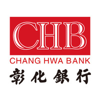
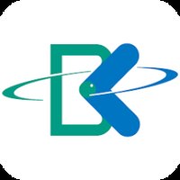

# Bank in Taiwan

- [Bank in Taiwan](#bank-in-taiwan)
  - [台灣各銀行代碼圖示及英文名稱對照表](#台灣各銀行代碼圖示及英文名稱對照表)

## 台灣各銀行代碼圖示及英文名稱對照表

| 代碼 | 圖示                                  | 銀行                 | Bank                                   |
| ---- | ------------------------------------- | -------------------- | -------------------------------------- |
| 004  |  | 臺灣銀行             | Bank of Taiwan                         |
| 006  |  | 合作金庫商業銀行     | Taiwan Cooperative Bank                |
| 007  |  | 第一商業銀行         | First Commercial Bank                  |
| 008  |  | 華南商業銀行         | Hua Nan Commercial Bank                |
| 009  |  | 彰化商業銀行         | Chang Hwa Commercial Bank              |
| 011  |  | 上海商業儲蓄銀行     | The Shanghai Commercial & Savings Bank |
| 012  |  | 台北富邦商業銀行     | Taipei Fubon Commercial Bank           |
| 013  |  | 國泰世華商業銀行     | Cathay United Bank                     |
| 016  |  | 高雄銀行             | Bank of Kaohsiung                      |
| 017  |  | 兆豐國際商業銀行     | Mega International Commercial Bank     |
| 021  |  | 花旗（台灣）商業銀行 | Citibank Taiwan                        |
| 048  |  | 王道商業銀行         | O-Bank                                 |
| 052  |  | 渣打國際商業銀行     | Standard Chartered Bank (Taiwan)       |
| 053  |  | 台中商業銀行         | Taichung Commercial Bank               |
| 054  |  | 京城商業銀行         | King's Town Bank                       |
| 081  |  | 滙豐（台灣）商業銀行 | HSBC Bank (Taiwan)                     |
| 101  |  | 瑞興商業銀行         | Taipei Star Bank                       |
| 102  |  | 華泰商業銀行         | Hwatai Bank                            |
| 103  |  | 臺灣新光商業銀行     | Shin Kong Commercial Bank              |
| 108  |  | 陽信商業銀行         | Sunny Bank                             |
| 118  |  | 板信商業銀行         | Bank of Panhsin                        |
| 147  |  | 三信商業銀行         | COTA Commercial Bank                   |
| 803  |  | 聯邦商業銀行         | Union Bank of Taiwan                   |
| 805  |  | 遠東國際商業銀行     | Far Eastern International Bank         |
| 806  |  | 元大商業銀行         | Yuanta Commercial Bank                 |
| 807  |  | 永豐商業銀行         | Bank SinoPac                           |
| 808  |  | 玉山商業銀行         | E.SUN Commercial Bank                  |
| 809  |  | 凱基商業銀行         | KGI Bank                               |
| 810  |  | 星展（台灣）商業銀行 | DBS Bank (Taiwan)                      |
| 812  |  | 台新國際商業銀行     | Taishin International Bank             |
| 816  |  | 安泰商業銀行         | Entie Commercial Bank                  |
| 822  |  | 中國信託商業銀行     | CTBC Bank                              |
| 823  |  | 將來商業銀行         | NEXT Bank                              |
| 824  |  | 連線商業銀行         | LINE Bank Taiwan                       |
| 826  |  | 樂天國際商業銀行     | Rakuten Bank                           |

_註: 以上圖示皆由銀行之 Google Play 及 LinkedIn 頁面取得_
